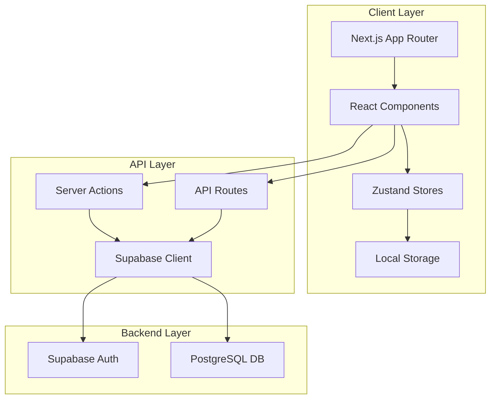

# Design Document

## Overview

This design document outlines the technical approach for making the Hamro Pustak Pasal website fully functional with UI bug fixes. The implementation will focus on completing missing functionality, fixing UI inconsistencies, and ensuring a seamless user experience across all pages and devices.

The website is built with:
- **Frontend**: Next.js 16 (App Router), React 19, Tailwind CSS 4, Framer Motion
- **Backend**: Supabase (PostgreSQL database, Authentication)
- **State Management**: Zustand for cart and wishlist
- **UI Components**: Radix UI primitives with custom styling

## Architecture



## Components and Interfaces

### 1. Admin Book Form Component

A reusable form component for both adding and editing books.

```typescript
interface BookFormProps {
  mode: 'create' | 'edit';
  initialData?: Book;
  onSubmit: (data: BookFormData) => Promise<void>;
}

interface BookFormData {
  title: string;
  author: string;
  description: string;
  excerpt: string;
  cover_url: string;
  price_hardcover: number;
  price_paperback: number;
  price_ebook: number;
  price_audiobook?: number;
  formats: string[];
  genres: string[];
  publisher: string;
  pages: number;
  isbn: string;
  is_bestseller: boolean;
  is_new: boolean;
  mood: string[];
}
```

### 2. Server Actions for Book Management

```typescript
// Create book action
async function createBook(formData: FormData): Promise<void>

// Update book action  
async function updateBook(id: string, formData: FormData): Promise<void>

// Delete book action (existing)
async function deleteBook(id: string): Promise<void>
```

### 3. Cart Store Interface (Existing - Zustand)

```typescript
interface CartStore {
  items: CartItem[];
  addItem: (item: CartItem) => void;
  removeItem: (bookId: string, format: string) => void;
  updateQuantity: (bookId: string, format: string, quantity: number) => void;
  clearCart: () => void;
  getTotalItems: () => number;
  getTotalPrice: () => number;
}
```

### 4. Wishlist Store Interface (Existing - Zustand)

```typescript
interface WishlistStore {
  bookIds: string[];
  addToWishlist: (bookId: string) => void;
  removeFromWishlist: (bookId: string) => void;
  isInWishlist: (bookId: string) => boolean;
  toggleWishlist: (bookId: string) => void;
}
```

## Data Models

### Book Table Schema (Supabase)

```sql
CREATE TABLE books (
  id UUID PRIMARY KEY DEFAULT gen_random_uuid(),
  title TEXT NOT NULL,
  author TEXT NOT NULL,
  cover_url TEXT,
  rating DECIMAL(2,1) DEFAULT 0,
  review_count INTEGER DEFAULT 0,
  price_hardcover DECIMAL(10,2),
  price_paperback DECIMAL(10,2),
  price_ebook DECIMAL(10,2),
  price_audiobook DECIMAL(10,2),
  formats TEXT[] DEFAULT '{}',
  reading_time INTEGER,
  genres TEXT[] DEFAULT '{}',
  description TEXT,
  excerpt TEXT,
  publish_date DATE,
  publisher TEXT,
  pages INTEGER,
  isbn TEXT,
  tags TEXT[] DEFAULT '{}',
  is_bestseller BOOLEAN DEFAULT false,
  is_new BOOLEAN DEFAULT false,
  mood TEXT[] DEFAULT '{}',
  created_at TIMESTAMPTZ DEFAULT NOW(),
  updated_at TIMESTAMPTZ DEFAULT NOW()
);
```

### Profiles Table Schema (for Admin Role)

```sql
CREATE TABLE profiles (
  id UUID PRIMARY KEY REFERENCES auth.users(id),
  role TEXT DEFAULT 'user',
  created_at TIMESTAMPTZ DEFAULT NOW()
);
```

### Cart Item (Client-Side)

```typescript
interface CartItem {
  bookId: string;
  format: 'hardcover' | 'paperback' | 'ebook' | 'audiobook';
  quantity: number;
  price: number;
}
```

## Correctness Properties

*A property is a characteristic or behavior that should hold true across all valid executions of a system-essentially, a formal statement about what the system should do. Properties serve as the bridge between human-readable specifications and machine-verifiable correctness guarantees.*


### Property 1: Cart total calculation consistency
*For any* cart with items, the total price SHALL equal the sum of (item.price × item.quantity) for all items, plus shipping (Rs. 150 if items exist), plus tax (13% of subtotal).
**Validates: Requirements 2.3**

### Property 2: Cart item addition increases count
*For any* book and format, adding it to the cart SHALL increase the total item count by the quantity added.
**Validates: Requirements 2.1**

### Property 3: Cart item removal decreases total
*For any* item in the cart, removing it SHALL decrease the total price by (item.price × item.quantity).
**Validates: Requirements 2.4**

### Property 4: Genre filter returns matching books only
*For any* selected genre filter, all books in the filtered results SHALL contain that genre in their genres array.
**Validates: Requirements 5.2**

### Property 5: Price filter returns books within range
*For any* price range [0, max], all books in the filtered results SHALL have a price (paperback or hardcover) less than or equal to max.
**Validates: Requirements 5.3**

### Property 6: Search filter matches title, author, or description
*For any* search query string, all books in the filtered results SHALL contain the query (case-insensitive) in either title, author, or description.
**Validates: Requirements 5.4**

### Property 7: Mood filter returns matching books only
*For any* selected mood filter, all books in the filtered results SHALL contain that mood in their mood array.
**Validates: Requirements 5.5**

### Property 8: Wishlist toggle is idempotent pair
*For any* book, toggling wishlist twice SHALL return the wishlist to its original state (add then remove = original).
**Validates: Requirements 6.4**

### Property 9: Wishlist persistence round-trip
*For any* book added to wishlist, the book ID SHALL be present in the wishlist store after page reload.
**Validates: Requirements 6.1**

### Property 10: Format selection updates price correctly
*For any* book and selected format, the displayed price SHALL equal book.price[format].
**Validates: Requirements 3.2**

### Property 11: Add to cart from detail page uses selected format
*For any* book with a selected format, adding to cart SHALL create a cart item with that format and the corresponding price.
**Validates: Requirements 3.3**

### Property 12: Empty filter results show empty state
*For any* combination of filters that matches zero books, the system SHALL display the empty state message.
**Validates: Requirements 8.2**

### Property 13: Book update round-trip consistency
*For any* book, updating its data and then fetching it SHALL return the updated values.
**Validates: Requirements 1.4**

### Property 14: Invalid form data shows validation errors
*For any* form submission with empty required fields (title, author), the system SHALL display validation error messages without creating a book.
**Validates: Requirements 1.5**

### Property 15: Authentication failure shows error message
*For any* invalid login credentials, the system SHALL display an error message and not redirect.
**Validates: Requirements 4.3**

### Property 16: Unauthenticated admin access redirects
*For any* admin route accessed without authentication, the system SHALL redirect to the login page.
**Validates: Requirements 4.5**

## Error Handling

### Client-Side Errors

| Error Type | Handling Strategy |
|------------|-------------------|
| Network failure | Display toast notification, retry with exponential backoff |
| Invalid form input | Show inline validation errors, prevent submission |
| Cart operation failure | Show error toast, maintain previous state |
| Authentication error | Display error message in form, clear sensitive fields |

### Server-Side Errors

| Error Type | Handling Strategy |
|------------|-------------------|
| Database connection failure | Fall back to mock data, log error |
| Unauthorized access | Redirect to login page |
| Invalid book ID | Return 404 page |
| Server action failure | Return error response, display to user |

### Fallback Mechanisms

1. **Database Fallback**: If Supabase is unavailable, the `getBooks()` function falls back to `MOCK_BOOKS` data
2. **Image Fallback**: Local book covers are prioritized over remote URLs via `LOCAL_COVER_MAP`
3. **Auth State**: Client-side auth state is synchronized with Supabase auth listener

## Testing Strategy

### Unit Testing Approach

Unit tests will verify specific examples and edge cases:

- Form validation logic (empty fields, invalid formats)
- Price calculation functions
- Filter logic functions
- Cart store operations
- Wishlist store operations

### Property-Based Testing Approach

Property-based tests will use **fast-check** library to verify universal properties across many random inputs:

- Cart calculations (Property 1, 2, 3)
- Filter operations (Property 4, 5, 6, 7)
- Wishlist operations (Property 8, 9)
- Format/price mapping (Property 10, 11)

Each property-based test will:
- Run a minimum of 100 iterations
- Use smart generators that constrain to valid input space
- Be tagged with the corresponding property number from this design document

### Test File Organization

```
src/
├── __tests__/
│   ├── cart-store.test.ts       # Cart store unit + property tests
│   ├── wishlist-store.test.ts   # Wishlist store unit + property tests
│   ├── filters.test.ts          # Filter logic property tests
│   └── book-form.test.ts        # Form validation tests
```

### Test Annotation Format

Each property-based test will be annotated with:
```typescript
// **Feature: website-functionality-bugfix, Property 1: Cart total calculation consistency**
```

## Implementation Notes

### Key Files to Create/Modify

1. **src/app/admin/add/page.tsx** - Complete the add book form
2. **src/app/admin/edit/[id]/page.tsx** - Complete the edit book form
3. **src/app/admin/actions.ts** - Add updateBook server action
4. **src/components/features/BookForm.tsx** - Reusable book form component

### UI Fixes Required

1. Fix cart drawer z-index and backdrop on mobile
2. Ensure consistent spacing in book cards
3. Fix admin dashboard mobile responsiveness
4. Ensure proper loading states across all pages

### Dependencies

No new dependencies required. Existing stack:
- fast-check (to be added for property testing)
- @testing-library/react (to be added for component testing)
- vitest (to be added as test runner)
